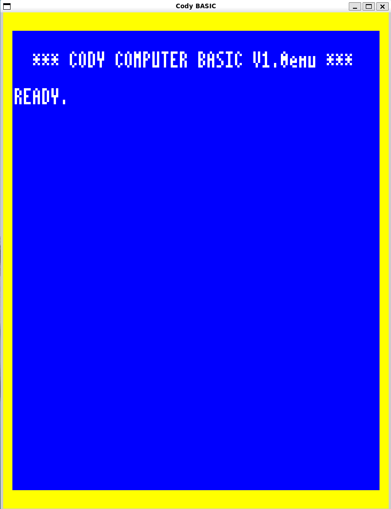
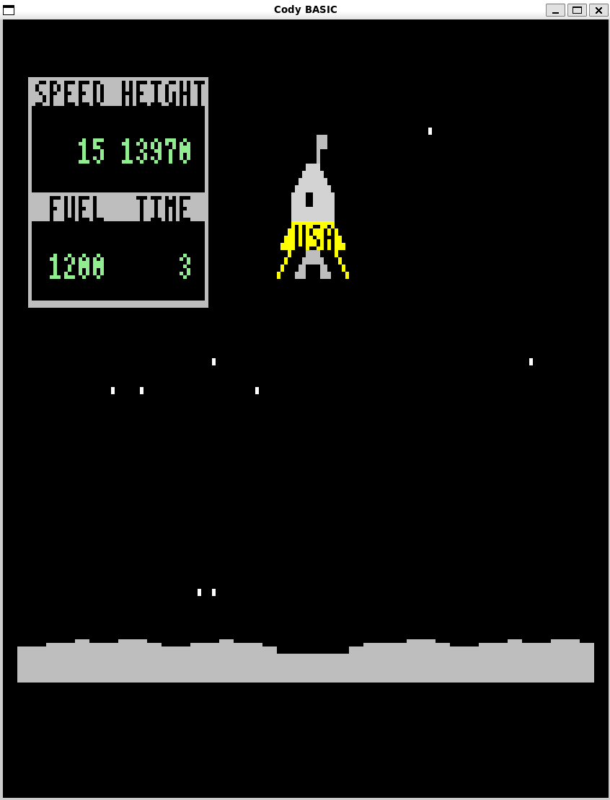

*work in progress*

# cody-basic-interpreter
see https://codycomputer.org/

# run help
`python cody_basic.py --help`

# repl
`python cody_basic.py` 
cancel with CTRL+D

# graphic mode
`python cody_basic.py -g`

`python cody_basic.py -g codylander.bas`

the graphic repl uses the cody keyboard layout. It maps cody to shift and the option key to CTRL.

